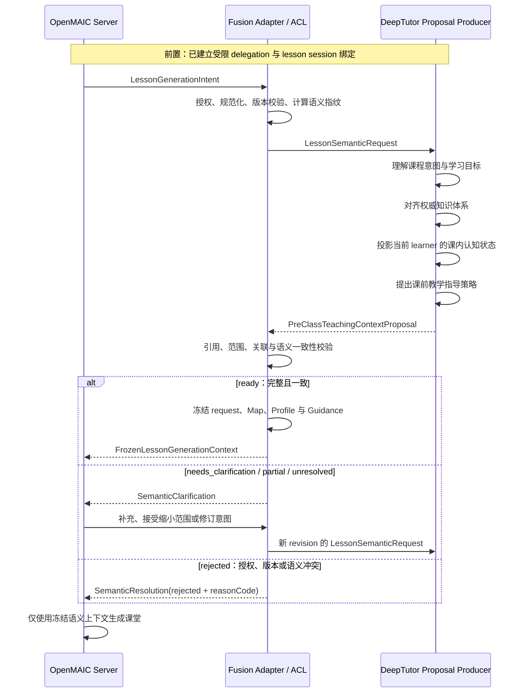

# 课堂前语义交换协议规范

## 1. 文档状态与范围

本文定义课堂生成前（Pre-Class Lesson Generation）OpenMAIC 与 DeepTutor 通过 Fusion Adapter 进行纯语义信息交换的规范。

- 状态：课前阶段协议设计基准；全局架构、职责和信任边界以 [`ARCHITECTURE.md`](../ARCHITECTURE.md) 为 SSOT。
- 全局边界：遵循 [`ARCHITECTURE.md`](../ARCHITECTURE.md) 的职责、信任边界、安全和生命周期不变量；本文只定义课前语义协议。
- 完整性规范：`semanticRequestDigest` 的计算以 [跨语言 Canonical Digest 规范](./10-canonical-hash-digest-and-integrity-specification.md)为 SSOT。
- 下游关系：本文冻结的上下文是[课堂中协议](./04-in-class-semantic-exchange-protocol.md)的语义根；代码迁移见[课堂前迁移路线](./03-pre-class-fusion-code-migration-roadmap.md)。
- 实现状态：本文不表示相关生产端口已经实现。
- 目标：将 OpenMAIC 的课堂生成意图与 DeepTutor 的学习者、知识和教学决策语义对齐，形成一份不可变的课堂生成上下文。
- 明确排除：课堂运行中的诊断与动态调整、课堂完成后的画像候选与回写、具体 UI/Scene 命令、底层 API 路径和实现代码。

本文使用的对象名定义目标领域语义；具体 HTTP、A2A 或消息协议形状由后续实现 Feature 定稿。

## 2. 核心模型

课前交互不是“OpenMAIC 分别请求 Profile 和 Map”，而是一次语义上下文化握手：

> OpenMAIC 表达“想生成什么课”；DeepTutor 判断“针对这个学习者，这门课应当怎样教”；Fusion Adapter 负责翻译、校验、对齐并冻结双方达成的语义上下文。

完整语义生命周期为：

```text
LessonGenerationIntent
  -> LessonSemanticRequest
  -> PreClassTeachingContextProposal
  -> SemanticResolution
  -> FrozenLessonGenerationContext
```

其中：

- `LessonGenerationIntent` 属于 OpenMAIC 内部课堂生成域。
- `LessonSemanticRequest` 是 Fusion 层向 DeepTutor 表达的规范化课程语义。
- `PreClassTeachingContextProposal` 是 DeepTutor 提案生产者对当前课程与 learner 的教学上下文化结果；提案生产者可以是当前有界确定性决策管线，也可以是未来经过契约约束的开放式 Agent。
- `SemanticResolution` 表达接受、需要澄清、部分解析或拒绝，不允许静默修正冲突。
- `FrozenLessonGenerationContext` 是 OpenMAIC 后续课堂生成唯一可使用的课前语义快照。

## 3. 参与方与职责

| 参与方 | 课前职责 | 不得承担的职责 |
| --- | --- | --- |
| OpenMAIC | 表达主题意图、学习目标、受众、材料引用和生成约束；消费冻结上下文生成课堂。 | 不得推断 DeepTutor 长期画像，不得自行伪造权威知识引用。 |
| Fusion Adapter | 将双方内部语言映射为 Fusion 契约；校验授权、版本、引用和语义一致性；冻结结果。 | 不得替 DeepTutor 生成教学判断，不得替 OpenMAIC 生成 UI 或 Scene。 |
| DeepTutor proposal producer | 依据同一 `LessonSemanticRequest` 生成结构化 Proposal；当前可由有界确定性决策管线提供，未来可由开放式 Agent 提供。 | 不得把内部推理、工具调用、原始模型输出、内部存储或 UI/Scene 命令带入 Proposal；不得绕过严格契约与 ACL。 |

Launch Code exchange、delegation credential 和服务端 session 是握手的安全前置条件，但不属于教学语义本身。任何语义请求都必须通过已经建立的受限委托确定 learner 与 lesson 绑定；请求正文不得覆盖 learner 身份。

## 4. 课前握手时序



握手可以有一次或有限次数的结构化澄清，但不得退化为无边界自然语言协商。每次修订都必须产生新的 request revision 和语义指纹。

## 5. 语义生命周期

### 5.1 捕获课堂生成意图

OpenMAIC 从用户要求、受控课程入口或服务端材料引用形成 `LessonGenerationIntent`。该对象表达课堂生成目标，不携带 OpenMAIC 的 UI 实现细节。

### 5.2 规范化为 Fusion 请求

Fusion Adapter：

1. 从受验证委托推导 learner 和允许的课程范围。
2. 标准化主题、学科、locale、学习目标和知识引用。
3. 去除 UI 字段、浏览器身份字段和无关材料内容。
4. 校验 authoritative ref 的完整作用域。
5. 为规范化结果生成 `semanticRequestId`、revision 和 `semanticRequestDigest`。
6. 形成 `LessonSemanticRequest` 交给 DeepTutor。

### 5.3 DeepTutor 教学上下文化

DeepTutor 的 Proposal 生产者基于同一份 `LessonSemanticRequest`：

1. 返回其实际理解的主题、目标和知识域。
2. 将课程目标解析为 `LessonKnowledgeMap`。
3. 只针对 Map 中的知识点投影 learner 的认知状态。
4. 基于知识关系、画像投影和教学约束提出教学指导。
5. 显式表达映射置信度、数据不足、歧义、范围冲突和未解析项。

DeepTutor 可以建议扩展、缩小或重排教学重点，但不得静默改写 OpenMAIC 的原始课程意图。

### 5.4 Adapter 语义对齐

Fusion Adapter 对以下语义链进行校验：

```text
Requested Topic and Objectives
  <-> Interpreted Topic and Objectives
  <-> LessonKnowledgeMap
  <-> Learner Cognitive Projection
  <-> Teaching Guidance
```

只有这五部分处于同一课程语义范围，且授权、schema、revision 与引用均有效时，结果才能进入冻结阶段。

### 5.5 冲突澄清与重新提交

如果 DeepTutor 无法可靠解析请求，Adapter 返回结构化 `SemanticClarification`。OpenMAIC 可以补充信息、接受 DeepTutor 建议的范围缩小，或提交新的课堂意图。

任何实质性修订都形成新的 `LessonSemanticRequest` revision；不得在旧 digest 下覆盖 topic、objectives、requested refs 或材料语义。

### 5.6 冻结课堂生成上下文

语义对齐成功后，Fusion Adapter 生成不可变的 `FrozenLessonGenerationContext`。OpenMAIC 的 outline、内容、checkpoint 和其他课堂生成步骤必须共同引用该快照，不得分别拉取不同 revision 的 Profile、Map 或 Guidance。

## 6. 输入契约

### 6.1 LessonGenerationIntent

`LessonGenerationIntent` 是 OpenMAIC 内部输入。最小语义结构如下：

```text
LessonGenerationIntent
  intentId
  intentRevision
  topicIntent
    title
    subject?
    targetDomain?
    locale
  learningObjectives[]
  audience
    educationStage?
    gradeLevel?
    priorKnowledgeAssumptions[]?
  teachingConstraints
    durationMinutes?
    depth?
    emphasis[]?
    exclusions[]?
  requestedKnowledgeRefs[]?
    namespace
    scopeId
    id
  sourceMaterialRefs[]?
    id
    digest
    purpose
  requirementSummary?
```

约束：

- `topicIntent` 和 `learningObjectives` 至少提供一种足以解释课堂目标的信息；过于模糊时必须进入澄清状态。
- `requestedKnowledgeRefs` 如果存在，必须使用完整权威引用，不能只传裸 knowledge-point ID。
- `sourceMaterialRefs` 默认只传服务端可验证引用、digest 和用途；正文传输需另行授权和最小化定义。
- `audience` 与 `teachingConstraints` 表达教学语义，不得包含页面模板、组件名、sceneId 或 route。
- `learnerId` 不由浏览器或该对象声明；它来自受验证 delegation。

### 6.2 LessonSemanticRequest

`LessonSemanticRequest` 是 Adapter 规范化后的 Fusion 输入：

```text
LessonSemanticRequest
  schemaVersion
  semanticRequestId
  semanticRequestRevision
  lessonSessionId
  semanticRequestDigest
  normalizedTopic
  normalizedLearningObjectives[]
  authorizedKnowledgeScope
  audienceSemantics
  teachingConstraints
  requestedKnowledgeRefs[]
  sourceMaterialRefs[]
  warnings[]
```

约束：

- learner 由 DeepTutor 从委托上下文推导，不得接受 payload 中的覆盖值。
- `semanticRequestDigest` 必须覆盖会改变课程语义的规范化字段，包括 topic、objectives、knowledge refs、材料 digest 和授权知识范围。
- 展示文案、网络时间戳和 Transport 元数据不得改变语义指纹。
- DeepTutor 的所有响应必须回显 request ID、request revision 和 digest。

Digest Projection Mapping：`semanticRequestDigest` 以 `LessonSemanticRequest` 的规范化投影为输入，而不是直接 hash 原始 `LessonGenerationIntent`。其中 `sourceMaterialRefs[].id` 规范化为 digest profile 的 `materialId`；`teachingConstraints.durationMinutes` 直接保留；`depth`、`emphasis`、`exclusions` 等原始约束只有在 Adapter 明确物化为 `maxSceneCount`、`requiredModes` 或 `prohibitedModes` 等规范化字段后才进入 digest。字段映射和数组语义的最终白名单以文档 `10` 为 SSOT。

## 7. DeepTutor 输出契约

### 7.1 PreClassTeachingContextProposal

```text
PreClassTeachingContextProposal
  schemaVersion
  proposalId
  basedOnSemanticRequestId
  basedOnSemanticRequestRevision
  semanticRequestDigest
  resolutionStatus: ready | needs_clarification | partial | unresolved | rejected
  interpretedLessonSemantics
  lessonKnowledgeMap
  learnerCognitiveProjection
  teachingGuidance
  sourceRevisions
  clarificationIssues[]
  warnings[]
  createdAt
```

该 Proposal 是 DeepTutor 提案生产者的教学决策产物，不包含 Agent 原始思维过程、工具调用记录或内部数据结构。当前有界确定性决策管线与未来开放式 Agent 都必须在 DeepTutor 内部完成推理、工具调用和结果收敛，并通过同一严格、版本化的 Proposal 契约输出；OpenMAIC 只依赖契约不变量，不依赖具体生产算法、提示词、模型、工具链或输出顺序。

### 7.1.1 Proposal producer compatibility

`PreClassTeachingContextProposal` is the stable cross-boundary contract; its producer is an implementation detail of DeepTutor. The current bounded deterministic Book/Spine/Progress decision pipeline is one valid producer, not a permanent protocol definition. A future open-ended Agent may use retrieval, tools, planning, or model reasoning internally, but the resulting output must pass the same contract and policy boundary before OpenMAIC can consume or freeze it.

The receiver may rely on these contract invariants:

- known `schemaVersion` and supported status values;
- request ID, revision, and `semanticRequestDigest` lineage;
- authorized `namespace + scopeId + id` references;
- mapping, learner projection, and guidance restricted to the current request and scope;
- explicit unresolved, insufficient-data, warning, and clarification states;
- source and business revisions sufficient for traceability;
- no credentials, raw learner records, raw provider response, chain-of-thought, tool trace, UI command, route, `sceneId`, or browser instruction.

The receiver must not depend on the current producer's lexical matching rules, hash construction, fixed policy labels, prompt wording, model choice, tool sequence, or deterministic ordering. If future Agent-backed generation needs provenance, confidence, evaluator results, or new guidance semantics, those fields require an additive versioned contract and a separate implementation decision; they cannot be smuggled through unknown fields or inferred by OpenMAIC.

A valid `ready` Proposal is producer-agnostic: it gives OpenMAIC a semantic teaching input, not a pre-class checkpoint/remediation scene plan. Runtime checkpoint attempts, diagnosis, remediation directives, and dynamic scene changes remain governed by the in-class protocol.


```text
InterpretedLessonSemantics
  interpretedTopic
  interpretedObjectives[]
  resolvedDomainScope
  proposedNarrowing[]?
  proposedExtensions[]?
  confidence?
```

它用于让 Adapter 比较“OpenMAIC 请求的课程”和“DeepTutor 实际理解的课程”。`proposedNarrowing` 与 `proposedExtensions` 都是建议，不能静默替换原请求。

### 7.3 LessonKnowledgeMap

```text
LessonKnowledgeMap
  schemaVersion
  mappingId
  mappingRevision
  semanticRequestDigest
  topic
  knowledgePoints[]
    lessonKnowledgePointId
    name
    role?
    authoritativeRef?
      namespace
      scopeId
      id
    mappingStatus: mapped | lesson_local | unresolved
    confidence?
  prerequisiteRelations[]?
  objectiveMappings[]
  requestResults
    matched[]
    unresolved[]
    invalid[]
  warnings[]
```

约束：

- `topic` 用于相关性解释，不能替代权威引用。
- 精确知识点请求必须逐项返回 matched、unresolved 或 invalid，不能静默忽略或替换。
- `lesson_local` 和 `unresolved` 不得伪装成可用于长期 mastery 的 authoritative mapping。
- Map 必须能够说明每个核心学习目标由哪些 lesson knowledge points 支撑。

### 7.4 LearnerCognitiveProjection

它是针对当前 `LessonKnowledgeMap` 的课内相关画像投影，不是 learner 的完整长期画像。

```text
LearnerCognitiveProjection
  schemaVersion
  profileRevision
  semanticRequestDigest
  knowledgeState[]
    lessonKnowledgePointId
    authoritativeRef?
    dataStatus
    mastery?
    confidence?
  strengths[]
  weakPoints[]
  relevantMisconceptions[]
  learningPreferences?
  warnings[]
  updatedAt
```

约束：

- 每个知识状态、强项、薄弱点或误解必须与当前 Map 中的 lesson knowledge point 关联。
- 没有足够证据时使用 `insufficient_data`，不得伪造 `mastery: 0`。
- 只输出完成本课个性化所需的最小投影，不得发送原始答题、Memory Markdown、聊天记录或内部路径。
- 学习偏好可以影响教学方式，不能替代结构化 mastery 证据。

### 7.5 TeachingGuidance

`TeachingGuidance` 表达协议无关的课前教学决策：

```text
TeachingGuidance
  guidanceRevision
  semanticRequestDigest
  priorityKnowledgePointIds[]
  prerequisiteActivation[]
  anticipatedMisconceptions[]
  recommendedStrategies[]
    targetLessonKnowledgePointIds[]
    strategyCode
    pedagogicalGoal
    confidence?
    rationaleCode?
  sequencingConstraints[]?
  assessmentFocus[]?
  exclusions[]?
  warnings[]
```

允许表达：

- “先区分战争原因与导火索，再分析条约影响”。
- “对某知识点优先使用对比解释或 worked example”。
- “某前置知识证据不足，应先进行轻量激活”。

禁止表达：

- “跳转到 scene-3”。
- “创建双栏 React 组件”。
- “调用某 route、修改播放器或插入某个页面”。

## 8. 澄清、冲突与解析状态

### 8.1 SemanticClarification

```text
SemanticClarification
  issueId
  issueType
  affectedFields[]
  reasonCode
  message?
  proposedNarrowing[]?
  candidateAuthoritativeRefs[]?
  requiredInformation[]?
```

`message` 只用于可读解释；流程判断必须依赖稳定的 `issueType` 和 `reasonCode`。

### 8.2 典型冲突处理

| 情况 | 处理 |
| --- | --- |
| Topic 或目标过于模糊 | 返回 `needs_clarification`，指出缺少的学科、年级、范围或学习结果。 |
| OpenMAIC 提供的权威引用不存在或越权 | 逐项标记 `invalid`；不得自动替换成相似知识点。 |
| 自然语言目标只能低置信度映射 | 返回 `partial` 或 `unresolved`，携带候选与置信度；核心目标未解析时不得宣称已完成个性化上下文化。 |
| DeepTutor 理解的主题与请求主题不一致 | Adapter 拒绝冻结并返回语义冲突。 |
| DeepTutor 建议扩大或缩小课程范围 | 作为显式 proposal 返回；只有 OpenMAIC 接受并产生新 request revision 后才能生效。 |
| 当前 learner 没有相关学习证据 | 这不构成 Fusion 失败。Map 可以有效，Projection 使用 `insufficient_data`；不得套用无关历史弱点。只要课程语义、Map、授权和协议关联可信，仍形成 `ready` 并冻结；后续课中、课后证据再逐步补充个性化依据。 |
| Profile 条目不属于当前 Map | Adapter 拒绝该条目；关键投影无法成立时拒绝冻结整个上下文。 |
| TeachingGuidance 指向 Map 外知识点 | Adapter 拒绝 guidance；不得让建议进入课堂生成。 |
| request digest、mapping revision 或关联 ID 不一致 | 视为过期或错配响应，丢弃并重新请求，不得拼接采用。 |
| schema 版本未知 | 失败关闭并返回版本不兼容，不得猜测字段语义。 |

### 8.3 冻结资格

只有满足以下条件才能生成 `FrozenLessonGenerationContext`：

1. 授权、lesson 绑定、schema 和关联 ID 有效。
2. DeepTutor 回显的 request revision 与 digest 一致。
3. 主题理解与核心学习目标不存在未接受的冲突。
4. Map 对核心目标有显式 matched、lesson-local 或受策略允许的解析结果。
5. Profile 中所有认知项都能关联当前 Map。
6. TeachingGuidance 中所有目标都能关联当前 Map。
7. 所有 invalid、unresolved、低置信度与数据不足状态均被显式保留，没有 Mock 或默认主题替换。
8. Learner Projection 的 `insufficient_data` 不阻止冻结：冻结资格取决于课程语义、Map、授权、schema、revision 与 digest 的可信关联，而不取决于画像是否丰富。

## 9. FrozenLessonGenerationContext

```text
FrozenLessonGenerationContext
  schemaVersion
  snapshotId
  lessonSessionId
  semanticRequestId
  semanticRequestRevision
  semanticRequestDigest
  acceptedLessonSemantics
  lessonKnowledgeMap
  learnerCognitiveProjection
  teachingGuidance
  sourceRevisions
    mappingRevision
    profileRevision
    guidanceRevision
  resolutionSummary
  warnings[]
  capturedAt
```

冻结规则：

- 快照创建后不可原地修改。
- topic、objectives、knowledge refs 或材料语义发生实质变化时，必须创建新的 semantic request revision 和新快照。
- Map、Profile 和 Guidance 必须来自同一个 request digest，不能分别更新后继续沿用旧 snapshot ID。
- OpenMAIC 后续课堂生成只能引用 server-owned snapshot；浏览器提交内容不能覆盖其中的 learner、Map、Profile、Guidance 或 revision。
- 本文只规定快照作为课堂生成输入，不规定其在课堂运行中如何使用。

## 10. 六条语义不变量

1. **共同语义根**：`LessonSemanticRequest` 是所有 DeepTutor 课前输出的共同语义根；所有组成部分必须回指同一 request revision 和 digest。

2. **目标可解释**：`LessonKnowledgeMap` 必须能够解释请求中的核心学习目标；无法解析的目标必须显式标记，不能静默忽略或替换。

3. **画像受 Map 约束**：`LearnerCognitiveProjection` 必须是基于当前 Map 的课程相关投影，不得混入与本课无关的历史弱点或偏好。

4. **指导受 Map 约束**：`TeachingGuidance` 必须只针对当前 Map 中的知识点和当前请求中的教学目标，不得携带具体 UI 或 Scene 命令。

5. **变更显式协商**：DeepTutor 对主题、目标或范围的扩展、缩小和冲突必须显式表达；未经 OpenMAIC 接受并形成新 request revision，不得覆盖原始意图。

6. **单一冻结上下文**：OpenMAIC 只能从同一份 `FrozenLessonGenerationContext` 生成课堂，不得自由混合其他 request、Profile、Map、Guidance 或历史 revision。

## 11. 跨边界允许与禁止的信息

| 允许的语义信息 | 禁止的信息 |
| --- | --- |
| 课程主题、学习目标、受众与教学约束 | React 组件、DOM、route、sceneId、播放器命令 |
| 权威知识点引用、映射状态、前置关系 | DeepTutor 内部知识库路径、索引结构或数据库记录 |
| 课内相关 mastery 状态、置信度和数据不足状态 | 原始答题历史、Memory Markdown、聊天全文 |
| 教学重点、策略、目标、原因码和范围建议 | Agent 思维过程、工具调用流和自由格式控制命令 |
| schema、revision、digest、warning 和 correlation 元数据 | token、Cookie、Secret、浏览器本地状态和非授权 learner 标识 |

## 12. 结果边界

课前握手完成只证明：

- OpenMAIC 与 DeepTutor 对本次课堂主题和知识范围形成了可追踪的语义对齐结果。
- 学习者画像与教学指导已经被限制在当前课程范围内。
- OpenMAIC 获得了一份版本化、不可变的课堂生成输入。

它不证明：

- DeepTutor 的模型推理或教学策略必然正确。
- 生成的课堂必然具有真实教学效果。
- 课堂中已经执行任何动态决策。
- 课堂结果已经写回长期画像。

已确认：`needs_clarification` 用于可由补充需求恢复的语义歧义；`partial`/`unresolved` 用于课程语义、知识映射或关键协议关联无法可靠解析；`rejected` 用于授权、版本或不可接受的语义冲突。画像 `insufficient_data` 不是上述状态，也不是普通课堂恢复条件。普通课堂只能在可信 Fusion Context 无法建立、发生不可恢复故障或用户明确退出 Fusion 时作为显式 non-Fusion 路径创建独立 Session，不得复用失败的 digest、Map、Guidance、旧 Profile/Map 或冻结数据。

已定稿：范围缩小或修订只能由当前课堂发起人经服务器 Session 绑定确认；教师可协助操作但没有独立覆盖权。`needs_clarification` 必须由发起人显式补充；`partial`、`unresolved`、`rejected` 不得自动修订或重试。每个初始请求最多允许一次实质修订，并产生新的 request revision、digest 与 Fusion Session；达到上限后只显示原因、技术重试入口（如适用）和显式 non-Fusion 恢复入口。材料正文读取的产品/授权策略仍为待决项。
