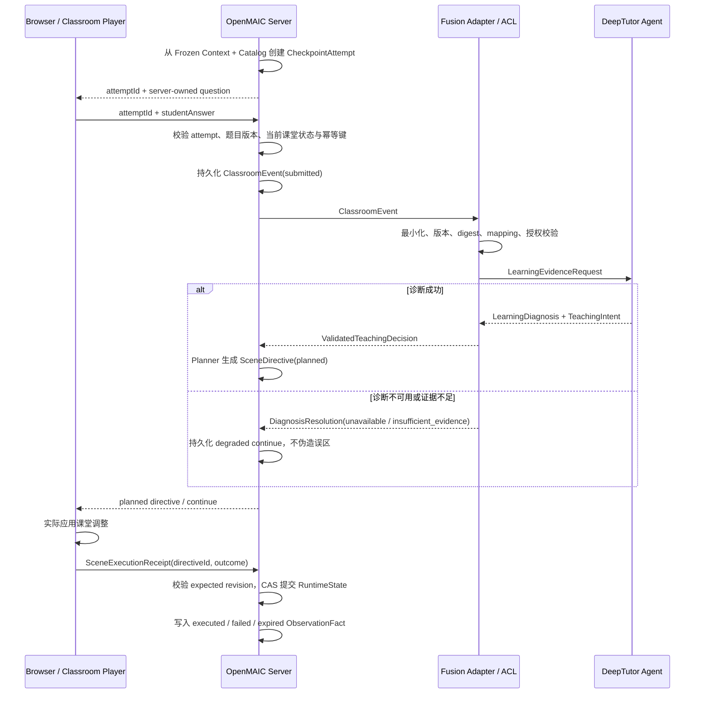

# 课堂中语义交换协议规范

## 1. 文档状态与范围

本文定义课堂运行中 OpenMAIC 与 DeepTutor 通过 Fusion Adapter 交换 checkpoint 学习证据、学习诊断和教学意图的语义协议。

- 状态：课中阶段协议设计基准；全局架构、职责和信任边界以 [`ARCHITECTURE.md`](../ARCHITECTURE.md) 为 SSOT。
- 全局边界：遵循 [`ARCHITECTURE.md`](../ARCHITECTURE.md) 的职责、信任边界、安全和生命周期不变量；本文只定义课中语义协议。
- 前置条件：课堂已经存在有效的 `FrozenLessonGenerationContext`、LessonKnowledgeMap、Scene Catalog 和 OpenMAIC 权威 Session。
- 完整性规范：`semanticRequestDigest` 的计算以 [Canonical Hash / Digest 与完整性规范](./10-canonical-hash-digest-and-integrity-specification.md)为 SSOT。
- 上下游关系：课前冻结上下文来自[课堂前协议](./02-pre-class-semantic-exchange-protocol.md)；可信 Observation Fact 进入[课堂后协议](./06-post-class-semantic-exchange-protocol.md)；代码迁移见[课堂中迁移路线](./05-in-class-fusion-code-migration-roadmap.md)。
- 明确排除：课堂生成、长期画像聚合算法、具体 React/播放器命令和底层实现代码。

## 2. 核心原则

课堂中跨系统交换的是“可信学习证据”和“协议无关教学决策”，不是浏览器 UI 状态：

> OpenMAIC 证明发生了哪个受控 checkpoint attempt；DeepTutor 判断该证据意味着什么并提出 TeachingIntent；OpenMAIC 再决定并执行具体 Scene 行为。

跨系统语义生命周期为：

```text
OpenMAIC server-owned CheckpointAttempt
  -> ClassroomEvent
  -> DeepTutor LearningDiagnosis + TeachingIntent
```

OpenMAIC 内部后续生命周期为：

```text
TeachingIntent
  -> SceneDirective(planned)
  -> SceneExecutionReceipt
  -> ClassroomObservationFact(executed / failed / degraded)
```

`SceneDirective`、sceneId、播放器状态和 `SceneExecutionReceipt` 不发送给 DeepTutor。DeepTutor 只需要知道教学证据及其后续是否产生了新的学习观察，不需要控制 OpenMAIC UI。

## 3. 语义所有权

| 语义对象 | 权威方 | 说明 |
| --- | --- | --- |
| Checkpoint、题目版本、允许作答窗口 | OpenMAIC | 来自冻结 Catalog 和服务器大纲。 |
| CheckpointAttempt | OpenMAIC | 绑定 learner session、checkpoint、题目、Map 和 attempt 序号。 |
| 学生答案 | 学习者输入；OpenMAIC 记录 | 浏览器只能提交给已签发 attempt。 |
| LocalAssessment | OpenMAIC advisory signal | 必须标明来源，不能直接成为 DeepTutor correctness。 |
| LearningDiagnosis | DeepTutor | 对当前证据的独立诊断，不自动成为长期画像事实。 |
| TeachingIntent | DeepTutor | 协议无关教学目标和策略，不包含 UI/Scene 命令。 |
| SceneDirective | OpenMAIC | 根据 Intent、Catalog、RuntimeState 和策略生成。 |
| Directive 执行事实 | OpenMAIC | 由实际执行层回执确认，不能由规划 CAS 代替。 |

## 4. 时序



## 5. OpenMAIC 的可信 CheckpointAttempt

浏览器提交答案前，OpenMAIC 必须创建服务器拥有的 attempt：

```text
CheckpointAttempt
  schemaVersion
  attemptId
  idempotencyKey
  lessonSessionId
  semanticRequestDigest
  mappingId / mappingRevision
  checkpointId
  lessonKnowledgePointIds[]
  questionRef
    questionId
    questionRevision
    questionDigest
  attemptNumber
  status: open | submitted | diagnosed | closed | expired
  issuedAt / expiresAt
```

规则：

- attempt 只能由当前 Session、当前 checkpoint 和服务器大纲创建。
- 浏览器只返回 `attemptId + studentAnswer`，不能提交 learner、mapping、checkpoint、question text、correctness 或 RuntimeState 覆盖。
- 相同 attempt 的网络重试必须复用同一 idempotency key，并返回原 event/decision 状态。
- 非 checkpoint Quiz、过期 attempt、题目 digest 不匹配或已完成课堂的 attempt 必须拒绝。

## 6. 跨域输入：LearningEvidenceRequest

`ClassroomEvent` 经 Adapter 最小化后形成 DeepTutor 可消费的 `LearningEvidenceRequest`：

```text
LearningEvidenceRequest
  schemaVersion
  diagnosisRequestId
  eventId
  idempotencyKey
  lessonSessionId
  semanticRequestDigest
  mappingId / mappingRevision
  checkpointRef
    checkpointId
    lessonKnowledgePointIds[]
    authoritativeRefs[]?
  attemptRef
    attemptId
    attemptNumber
  questionEvidence
    questionId
    questionRevision
    questionDigest
    promptText?          # 诊断必需时的最小题面
  learnerResponse
    answerText
  localAssessment?
    source: openmaic_local
    gradingMode
    correctness?
    confidence?
  occurredAt
```

约束：

- learner 从 delegation 推导，不出现在可覆盖 payload 中。
- `semanticRequestDigest`、mapping 和知识点必须与课前冻结上下文一致。
- Adapter 从 OpenMAIC 权威 attempt 补齐 checkpoint 和 question，不信任浏览器提供的对应字段。
- `localAssessment` 是带来源的输入信号，不是 DeepTutor 诊断结论。
- `localAssessment.confidence` 只表达 OpenMAIC 本地观察/评分信号的可靠度，不得解释为诊断置信度或长期聚合置信度。
- 题面与答案只有在诊断确实需要时才跨域，不携带 Scene、Prompt 模板、聊天记录、Memory 或 UI 状态。

## 7. 跨域输出：LearningDiagnosis 与 TeachingIntent

```text
LearningDiagnosis
  schemaVersion
  diagnosisId
  eventId
  semanticRequestDigest
  mappingId / mappingRevision
  status: ready | partial | insufficient_evidence | rejected
  correctness: correct | incorrect | partially_correct | unknown
  correctnessSource: deeptutor_agent | deterministic_policy | insufficient_evidence
  diagnoses[]
    lessonKnowledgePointId
    misconceptionCode?
    confidence
  teachingIntent
  warnings[]
  createdAt

TeachingIntent
  schemaVersion
  kind: continue | insert_remediation | retry_checkpoint
  targetLessonKnowledgePointIds[]
  recommendedStrategy
  pedagogicalGoal?
  confidence?
  rationaleCode?
```

规则：

- DeepTutor 必须独立形成 `correctness`，不能无声明地复制 `localAssessment.correctness`。
- `diagnoses[].confidence` 只表达本次 DeepTutor 诊断的置信度，不得与 mapping、观察采集或长期聚合置信度合并为通用总分；四类 confidence 的内部语义以 [DeepTutor 自动画像流水线](./09-candidate-inbox-driven-profile-pipeline.md)为准。
- 若使用确定性或 synthetic Provider，必须通过 `correctnessSource` 和 warning 显式标识。
- 证据不足时返回 `unknown + insufficient_evidence`，不能虚构误区或低 mastery。
- TeachingIntent 不得包含 sceneId、route、组件、播放器命令或 OpenMAIC RuntimeState 写操作。
- target knowledge points 必须属于当前 Map；未知或越界输出由 Adapter 拒绝。

## 8. Adapter 校验与决议

Adapter 必须校验：

1. delegation 的 audience、scope、lesson 和 expiry。
2. request/response schema 版本与大小限制。
3. eventId、semantic digest、mapping ID/revision 回显一致。
4. diagnosis knowledge points 属于当前 Map。
5. TeachingIntent kind 和 strategy 属于已知协议枚举。
6. synthetic/development warning 不被正式路径静默忽略。
7. 相同 event/idempotency key 不产生冲突 diagnosis。

Adapter 输出给 OpenMAIC 的决议只有：

```text
ready
partial
insufficient_evidence
diagnosis_unavailable
rejected
```

## 9. 诊断失败与 durable degradation

`checkpoint_submitted` 是已经发生的课堂事实，不能因为 DeepTutor 不可用而消失。

正确顺序是：

1. OpenMAIC 以稳定 eventId/idempotency key 持久化 submitted event。
2. 再调用 DeepTutor 诊断。
3. 成功时关联 diagnosis 和 planned directive。
4. 超时、熔断、凭证暂不可用、payload 无效或 event mismatch 时，关联 `diagnosis_unavailable`。
5. 返回安全的 `continue + reasonCode`，但不生成 misconception 或长期画像结论。

客户端重试同一 attempt 时必须查询并返回原 event 状态，不能创建新的 eventId。

## 10. Planned Directive 与实际执行

OpenMAIC 内部 Directive 状态至少包括：

```text
planned -> executed
        -> failed
        -> expired
        -> superseded
```

- Planner 只产生 `planned`。
- `expectedRuntimeRevision` 保护计划所基于的状态，但写入计划不等于改变播放器。
- 对需要改变 Scene 的 Directive，OpenMAIC 签发一次性 execution nonce；执行层回传 `directiveId`、nonce、outcome、实际目标和 observed runtime revision。
- 服务端只接受与已保存 planned Directive 完全匹配的回执；浏览器不得通过 receipt 改写 target Scene、checkpoint 或 expected revision。
- 只有有效 execution receipt 才能把 Directive 标为 executed，并推进 `currentSceneId`、retry count 或 used remediation。
- checkpointId 必须来自当前 Catalog/Directive，不得硬编码 development checkpoint。
- receipt 丢失时保持 planned/unknown，可安全恢复或过期，不能预先记录 executed。
- `continue` 不要求页面跳转时，可由服务端记录为 `executed/no_scene_change`，但不能声称浏览器执行了不存在的动作，也不能标记为 degraded。

最小执行回执语义为：

```text
SceneExecutionReceipt
  directiveId
  executionNonce
  expectedRuntimeRevision
  outcome: applied | failed
  observedTargetSceneId?
  reasonCode?
  occurredAt
```

该回执只能证明 OpenMAIC 执行层确认应用了已签发的 Directive，不证明学生已经观看、理解或完成了教学内容。

## 11. 课堂观察事实

最终 `ClassroomObservationFact` 应保留：

```text
eventId / attemptId
semanticRequestDigest
mappingId / mappingRevision
checkpointId / lessonKnowledgePointIds
local assessment source
diagnosis status / diagnosisId
teaching intent summary
directiveId / plannedAt
executionStatus / executedAt?
degradation reason?
```

正常 `continue` 是成功决策，不是 degraded；只有存在明确 degradation reason 时才标记 degraded。

## 12. 课堂中语义不变量

1. 浏览器答案只能绑定服务器签发的 checkpoint attempt。
2. event ID 和 idempotency key 在网络重试中保持稳定。
3. 所有事件、诊断和意图共享课前 semantic digest 与 mapping revision。
4. DeepTutor diagnosis 与 OpenMAIC local assessment 必须区分来源。
5. TeachingIntent 不包含 UI/Scene 命令，SceneDirective 只由 OpenMAIC 生成。
6. 已发生的 event 在诊断失败时仍形成 durable degradation fact。
7. planned 不等于 executed，只有执行回执才能推进权威 RuntimeState。
8. 只有真实、可追踪的课堂观察事实才能进入课后 Candidate 投影。

## 13. 结果边界

课堂中协议完成只证明某次 checkpoint 证据、即时诊断、教学意图和实际执行结果可追踪。它不证明长期 mastery 已改变，也不允许把单次错误直接写成长久薄弱点。

`partial`、`insufficient_evidence` 的教师确认、课堂 UI 恢复和最大修订/重试策略仍为待决项；本文不替产品策略定稿。
