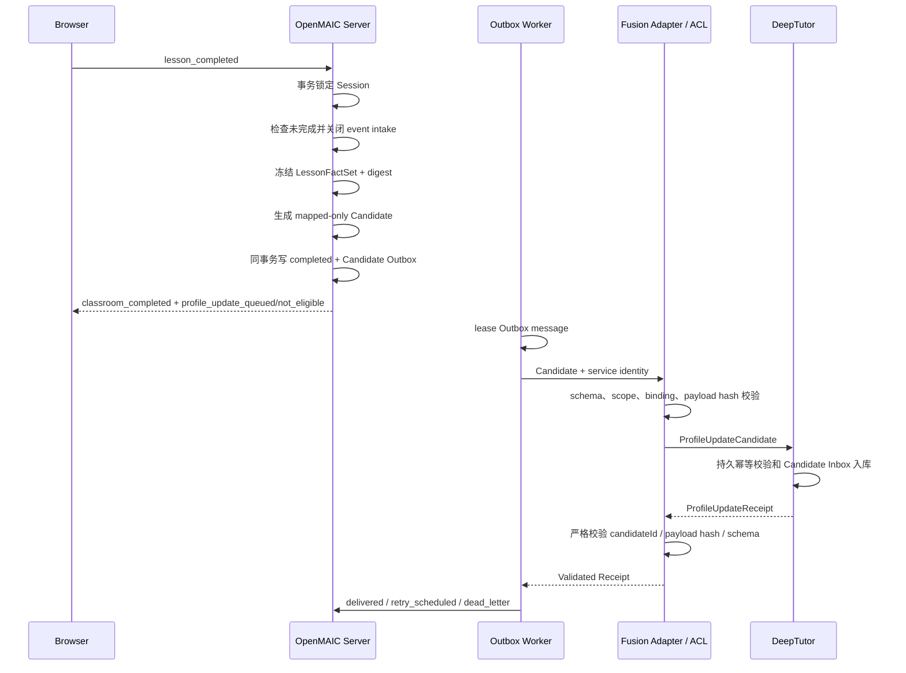

# 课堂后语义交换协议规范

## 1. 文档状态与范围

本文定义课堂完成后 OpenMAIC 与 DeepTutor 通过 Fusion Adapter 交换最小学习观察候选和接收回执的语义协议。

- 状态：课后阶段协议设计基准；全局架构、职责和信任边界以 [`ARCHITECTURE.md`](../ARCHITECTURE.md) 为 SSOT。
- 全局边界：遵循 [`ARCHITECTURE.md`](../ARCHITECTURE.md) 的职责、信任边界、安全和生命周期不变量；本文只定义课后语义协议。
- 输入前提：课堂中协议已经产生可信、幂等且包含 mapping/execution 状态的权威课堂事实。
- 专门规范：learner 解析以 [Learner 身份与状态模型](./08-deeptutor-learner-state-and-identity-resolution.md)为 SSOT；Candidate 接收后的 DeepTutor 内部处理以[自动画像流水线](./09-candidate-inbox-driven-profile-pipeline.md)为 SSOT；digest/hash 计算以[Canonical Hash / Digest 与完整性规范](./10-canonical-hash-digest-and-integrity-specification.md)为 SSOT。
- 实施关系：本文只定义课后跨域协议；当前代码如何迁移见[课堂后迁移路线](./07-post-class-fusion-code-migration-roadmap.md)。
- 明确排除：DeepTutor 长期画像聚合算法、模型 prompt、具体数据库实现和 UI。

## 2. 核心原则

课堂后交换的是“供 DeepTutor 校验和聚合的观察候选”，不是 OpenMAIC 对长期画像的写入命令：

```text
Frozen Lesson Fact Set
  -> ProfileUpdateCandidate
  -> Durable Outbox
  -> DeepTutor Candidate Inbox
  -> ProfileUpdateReceipt
```

`accepted`、`queued` 或 `duplicate` 只表示 Candidate 已被可靠接收或识别，不表示 mastery、偏好、弱点或长期画像已经改变。

## 3. 语义所有权

| 对象 | 权威方 | 说明 |
| --- | --- | --- |
| Classroom facts 与实际 Scene 路径 | OpenMAIC | 本节课堂发生了什么。 |
| Lesson closeout 与 frozen fact set | OpenMAIC | 确定 Candidate 的完整事实边界。 |
| ProfileUpdateCandidate | OpenMAIC | 最小化观察证据，不指定长期结论。 |
| Candidate 接收、校验和去重 | DeepTutor | 持久 Inbox 和 Receipt。 |
| 投递、重试、dead-letter、discard | OpenMAIC | Outbox 可靠性状态。 |
| 长期画像聚合 | DeepTutor | 独立于 Candidate 接收，可能 applied、ignored 或 deferred。 |

## 4. 课堂完成时序



## 5. 原子 closeout 与 FrozenLessonFactSet

课堂完成必须在一个权威事务边界内：

1. 锁定当前 Fusion Session。
2. 检查 `completedAt`；重复完成返回原 closeout 结果。
3. 阻止新的 checkpoint event 进入已完成 Session。
4. 读取并冻结所有已提交的权威课堂事实。
5. 生成 `factSetRevision` 和 canonical `factSetDigest`。
6. 根据资格策略创建零个或一个 Candidate。
7. 写 completion marker、Session completed 状态和 Candidate Outbox。
8. 原子提交。

不得先生成 Candidate、再独立更新 Session completed；也不得允许 closeout 后的新事实留在 Candidate 之外。

```text
FrozenLessonFactSet
  lessonSessionId
  semanticRequestDigest
  mappingId / mappingRevision
  factSetRevision
  factSetDigest
  sourceEventIds[]
  closedAt
```

Fact set 是 OpenMAIC 内部权威边界，不向 DeepTutor 发送原始题目、答案或完整课堂记录。

## 6. Candidate 资格投影

Observation 只有满足以下条件才可进入 Candidate：

- 来源 event 属于 frozen fact set。
- event/attempt 是服务器验证并幂等记录的真实 checkpoint。
- lesson knowledge point 属于冻结 Map。
- `mappingStatus` 必须是 `mapped`。
- authoritative ref 必须完整包含 `namespace + scopeId + id`。
- mapping ID/revision 与 frozen context 一致。
- observation kind、value、provenance 和任何已定稿的 confidence 字段符合已知 schema。

`lesson_local`、`unresolved`、缺失 mappingStatus 或残留 authoritative ref 的条目都不得进入长期候选。

误区信号只能来自 DeepTutor diagnosis 或其他明确来源；OpenMAIC local correctness 不能单独升级为长期 misconception claim。

## 7. ProfileUpdateCandidate 契约

```text
ProfileUpdateCandidate
  schemaVersion
  candidateId
  idempotencyKey
  canonicalPayloadHash
  lessonSessionId
  semanticRequestDigest
  mappingId / mappingRevision
  factSetRevision / factSetDigest
  sourceEventIds[]
  observations[]
    observationId
    kind: assessment_result | misconception_signal | engagement_signal
    lessonKnowledgePointId
    authoritativeRef
      namespace
      scopeId
      id
    value
    provenance
      source: deeptutor_diagnosis | openmaic_observation
      sourceEventId
      sourceDiagnosisId?      # source = deeptutor_diagnosis 时必须提供
      diagnosisRevision?      # source = deeptutor_diagnosis 时必须提供
  createdAt
```

`sourceDiagnosisId` 与 `diagnosisRevision` 是 DeepTutor diagnosis 来源的 provenance 关联字段，用于 DeepTutor 在接收 Candidate 后重新读取自己的权威 DiagnosisRecord 并校验 revision。`source = openmaic_observation` 时二者必须缺失。

Candidate 协议当前不定稿 generic `confidence` wire 字段。mapping、diagnosis、observation 和 aggregation confidence 具有不同语义；最终 wire 字段及其是否进入 `canonicalPayloadHash` 必须在后续实现 Feature 中由文档 `06` 与文档 `10` 同步提升 schema/digest version 后确定，不得临时压缩成一个总分。

禁止字段和语义：

- `newMastery`、`setWeakPoint`、`updatePreference` 等长期写入命令。
- 原始问题、完整答案、Prompt、Memory、聊天记录、Scene 内容或凭证。
- Map 外知识点或未映射引用。
- 从单次错误直接声明长期 mastery 变化。

## 8. 后台服务身份

Worker 的授权生命周期长于课堂 delegation，因此必须使用独立服务身份：

- audience 限定 DeepTutor Fusion Candidate Inbox。
- scope 最小化为 `profile-update:submit`。
- DeepTutor 在 Launch Code exchange 时持久创建 `lessonSessionId -> learnerSubjectId` 的 Lesson Binding；Candidate 只携带 `lessonSessionId`，接收端查询 Binding 解析 learner。
- 不依赖原课堂 delegation 仍在 DeepTutor 单进程内存中或尚未过期。
- 服务身份轮换、撤销和失败必须可审计。
- 服务凭证暂时不可用属于 transient failure，不应首次直接 dead-letter。

learner 不由浏览器或 Candidate 自由指定；Adapter 与 DeepTutor 必须按文档 `08` 的持久 Lesson Binding 解析并校验绑定。签名声明或统一授权服务仅是未来架构变化时可能重新评估的替代方案，不属于当前目标协议。

## 9. DeepTutor Candidate Inbox 与幂等

DeepTutor 必须持久保存：

```text
idempotencyKey
candidateId
canonicalPayloadHash
lesson/learner binding
schemaVersion
receipt
receivedAt
```

处理规则：

- 首次合法 Candidate：`accepted` 或 `queued`。
- 相同 key、相同 candidateId、相同 payload hash：返回原 `duplicate`/原 Receipt 语义，不重复聚合。
- 相同 key 但 candidateId 或 payload hash 不同：`rejected + idempotency_conflict`。
- DeepTutor 重启后仍保持上述结果。
- 字段不完整、Map 越界、长期结论命令或授权不匹配：明确 rejected。

## 10. ProfileUpdateReceipt 契约

```text
ProfileUpdateReceipt
  schemaVersion
  receiptId
  candidateId
  idempotencyKey
  canonicalPayloadHash
  status: accepted | queued | duplicate | rejected
  reasonCode?
  receivedAt
```

OpenMAIC Adapter 必须严格检查：

- 已知 schema。
- candidateId、idempotency key 和 payload hash 与当前 Outbox message 完全一致。
- status、reasonCode 和 receivedAt 合法。
- 200 response 缺少关联字段时视为无效 Receipt，不能标记 delivered。

Receipt 不携带“mastery 已更新”结论。未来若需要反馈长期聚合结果，应使用独立的 `ProfileAggregationOutcome` 协议和新的 profile revision，不得扩张 Receipt 的接收语义。

## 11. Outbox 状态与失败分类

最小状态机：

```text
pending -> processing -> delivered
                    -> retry_scheduled -> processing
                    -> dead_letter -> replayed -> pending
                                  -> discarded
```

- `transient`：网络、DNS、超时、5xx、429、Secret/Service Identity 暂不可用；保留原 candidate/idempotency key 并有限重试。
- `permanent`：schema invalid、授权永久拒绝、idempotency conflict、明确业务 rejected；进入 dead-letter。
- 错误分类必须检查结构化错误及 cause chain，不能把未知网络错误默认视为永久失败。
- `discarded` 是不可重放终态；可以删除敏感 payload，只保留脱敏审计元数据。
- replay 必须拒绝 discarded，并复用原 candidate/idempotency key。

## 12. 数据生命周期

删除与保留必须由协调式 lifecycle job 覆盖：

```text
Fusion Session
Classroom facts
Completion marker / Frozen fact-set metadata
Outbox payload and Receipt
Delegation credential Secret
DeepTutor Candidate Inbox
```

- 数据库内删除应尽量事务化。
- 外部 Secret 删除通过可重试任务完成并记录脱敏审计。
- learner/lesson 删除必须防止留下孤儿 facts、completion、Outbox 或 Secret。
- delivered、dead-letter、discarded 和 Candidate Inbox 分别配置保留期。
- 审计记录只保存必要元数据，不保存原始答案或凭证。

## 13. 冲突与结果处理

| 情况 | 处理 |
| --- | --- |
| event 与 closeout 并发 | Session 行锁决定顺序；completed 后的新 event 被拒绝。 |
| 重复 closeout | 返回原 fact-set/candidate 状态，不重建不同 Candidate。 |
| 没有 eligible observation | 正常完成课堂，返回 `profile_update_not_eligible`，不制造空 Candidate。 |
| non-mapped observation | 排除并记录最小 reason；不得进入 Candidate。 |
| transient Worker failure | retry_scheduled，保留原 ID。 |
| permanent Candidate rejection | dead_letter，保留 reason 和管理入口。 |
| 相同 key 不同 payload | DeepTutor rejected，OpenMAIC 不得当作 duplicate。 |
| Receipt 关联不匹配 | 视为无效响应并按明确错误策略处理，不标记 delivered。 |
| accepted/queued/duplicate | 只更新投递状态，长期画像仍为 not_confirmed。 |

## 14. 课堂后语义不变量

1. closeout、completed 状态、fact-set freeze、Candidate 和 Outbox 必须共享一个权威事务边界。
2. closeout 后不得接收新的课堂事实；重复 closeout 返回同一结果。
3. Candidate 是最小观察证据，不是长期画像写入命令。
4. 只有 `mapped + authoritativeRef` 的观察有资格进入 Candidate。
5. Candidate ID、idempotency key、payload hash 和 Receipt 必须持久、稳定且严格关联。
6. Worker 服务身份不依赖短期课堂 delegation 的内存存在或有效期。
7. accepted、queued 或 duplicate 不等于长期画像已更新。
8. Session、facts、completion、Outbox、Receipt、Secret 和 Inbox 必须具有统一删除与保留闭环。

## 15. 结果边界

课堂后协议完成只证明一组冻结课堂观察已作为 Candidate 被可靠提交、拒绝或去重。真正的长期画像校验、聚合、冲突消解和 profile revision 变化仍由 DeepTutor 的独立领域流程负责。

Candidate 中 confidence 的最终 wire 字段及其 `canonicalPayloadHash` 投影仍为待决项；实现不得把 mapping、diagnosis、observation 和 aggregation confidence 合并为一个通用分数。Candidate Inbox 的物理后端同样待实现 Feature 选定。
