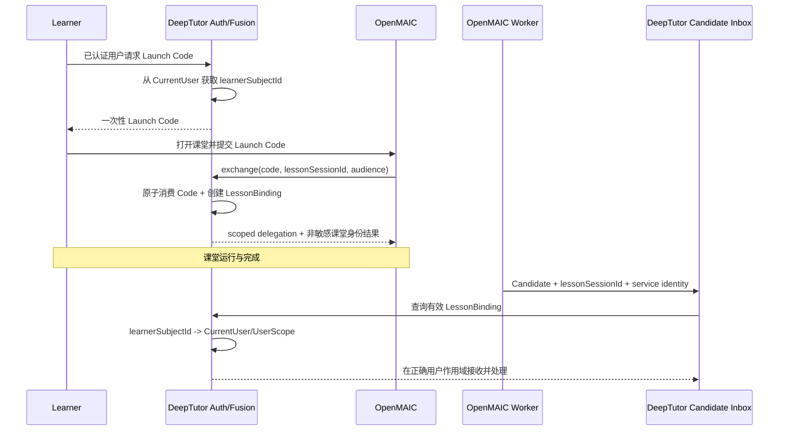

# Learner 身份与状态模型

## 1. 文档定位与状态

本文统合 DeepTutor 学生状态、长期画像、Agent 会话状态和 Fusion Learner 身份解析的讨论结论。

- 性质：DeepTutor 状态分层与 learner 解析的跨阶段专项基础规范；遵循 [`ARCHITECTURE.md`](../ARCHITECTURE.md) 的全局身份、安全和生命周期边界，并关闭文档 `06` 曾保留的课后身份三选一问题。
- 当前实现状态：本文描述的持久 `LessonBinding` 和真实用户画像接入尚未实现。
- 架构优先级：[`ARCHITECTURE.md`](../ARCHITECTURE.md) 仍是全局 SSOT；本文是 Learner 身份与状态的 FUSION 专项设计基准，不表示相关代码已经实现。
- 适用参与方：DeepTutor Auth、Multi-user Context、Session Store、Memory、Mastery、Fusion Route/Worker，以及 OpenMAIC Fusion Adapter。
- 明确排除：Candidate Inbox 的完整处理状态机、数据库 DDL、Agent prompt、长期画像算法和实际代码迁移；后台流水线见[文档 `09`](./09-candidate-inbox-driven-profile-pipeline.md)。
- 关系：本文是跨阶段身份基础，不是课后协议的子文档；文档 `09` 依赖本文恢复后台用户作用域，具体代码迁移见[文档 `07`](./07-post-class-fusion-code-migration-roadmap.md)。

## 2. 为什么必须先区分“学生状态”

“学生画像”在 DeepTutor 当前代码和 Fusion 讨论中可能指向不同对象。如果不先拆分，身份解析容易被错误设计成“找到一个聊天 Session”或“直接读取一个 Markdown 文件”。

DeepTutor 至少存在四类状态：

| 状态 | 作用域 | 权威载体 | 是否等于长期画像 |
| --- | --- | --- | --- |
| Conversation Session | 一次对话 | Session Store 的 session/message/turn/history summary | 否 |
| Three-layer Memory | 一个 DeepTutor 用户，跨 Session 与业务 surface | L1 snapshot/trace、L2 surface docs、L3 synthesis docs | L3 `profile` 最接近长期综合画像，但不是全部学习状态 |
| Mastery Progress | 一个用户的一条 Learning/Mastery Path | 结构化 attempt history、mastery level、review state | 否，是知识掌握度的结构化状态 |
| Fusion Lesson State | 一次 OpenMAIC 课堂 | lesson binding、Candidate Inbox、Fusion facts、processing runs | 否，是跨系统接入与证据处理状态 |

这四类状态必须保持不同的 ID、生命周期、更新规则和所有权。

## 3. Conversation Session：Agent 的短期上下文

DeepTutor 是对话型 Agent，但它不依赖某个 Agent 实例一直存活来维持状态。每个 Turn 到来时，运行时会：

1. 通过 `session_id` 从 Session Store 读取历史消息。
2. 在上下文窗口限制内保留近期消息，并对较旧消息进行摘要。
3. 根据当前请求选择的 Memory、Persona、Knowledge Base、附件和工具重新组装 `UnifiedContext`。
4. 执行 Agent/Capability。
5. 将用户消息、Agent 回复、Turn 状态和必要元数据重新持久化。

因此：

- 进程重启不应让持久 Session 消失。
- 一个 OpenMAIC 课堂不需要绑定到一个永不结束的 DeepTutor Agent 对话。
- Fusion Worker 不需要模拟 WebSocket 聊天或伪造用户消息来保持 Agent 状态。
- 后台 Agent 每次运行都应从持久事实重新构造受限上下文。

## 4. Three-layer Memory：跨 Session 的长期综合

DeepTutor Memory 当前按用户工作区隔离，结构为：

```text
L1
  workspace snapshot + append-only trace
  surfaces: chat / quiz / notebook / kb / book / partner / cowriter
    ↓
L2
  L2/<surface>.md
  按来源整理的可审计事实
    ↓
L3
  L3/profile.md
  L3/recent.md
  L3/scope.md
  L3/preferences.md
```

### 4.1 L1

L1 保存用户工作区的原始或近原始事实。Chat snapshot 会读取多个 Session 的对话；Quiz snapshot 会读取记录的题目、答案和判断。L1 Trace 是 append-only、best-effort 的审计/记忆输入，不适合作为事务性 Candidate Inbox。

### 4.2 L2

L2 按 surface 将新 L1 实体提炼为事实。`L2/chat.md` 可能综合多个 Chat Session；`L2/quiz.md` 可能综合多次 Quiz，而不是只代表当前 Session。

### 4.3 L3

L3 从多个 L2 surface 综合长期信息：

- `profile`：较稳定的综合画像。
- `recent`：近期变化或活动。
- `scope`：长期关注、学习或工作范围。
- `preferences`：用户明确表达的偏好；当前主要由 `write_memory` 直接写入，不走自动 Consolidation。

### 4.4 更新触发的当前事实

发生对话或 Quiz 会产生可供 Memory 使用的持久数据，但不保证 L2/L3 立即更新。当前 L2/L3 Consolidation 主要由 Memory Workbench/API 人工启动；聊天中仅明确偏好可以通过 `write_memory` 直接写入 `preferences`。

所以不得假设：

```text
一次对话结束 == L3 profile 已生成
一次课堂结束 == L3 profile 已更新
```

## 5. Mastery Progress：结构化掌握度而不是 Memory 文本

Mastery Progress 独立保存一条学习路径的：

- knowledge point。
- attempt history。
- quantitative/qualitative mastery。
- 当前模块、复习队列、诊断和错误。
- progress version。

Mastery 由领域策略根据多次可信 attempt 计算。单次正确、错误或 Agent 判断只能成为证据，不能由外部 Candidate 或自由 Agent 输出直接执行：

```text
set mastery = 0.9
set weak point = true
```

L3 Memory 可以描述学习模式，Mastery 可以提供结构化掌握度；二者可以互相作为投影输入，但不能共享同一写入语义。

## 6. Fusion Profile 的正确含义

Fusion 对 OpenMAIC 输出的 `StudentProfile` 或 `LearnerCognitiveProjection` 应是 DeepTutor 领域服务生成的最小、版本化投影，而不是：

- Agent 自由对话回答。
- 原始 `L3/profile.md`。
- 整个用户 Memory。
- 单个 Chat Session 的摘要。
- Mastery 文件或数据库行的直接透传。

DeepTutor 内部可以组合：

```text
Memory L3
Mastery Progress
Quiz/Learning Evidence
Recent valid observations
Knowledge authority
```

跨 Fusion 边界只返回当前课堂需要的结构化结果、revision、数据不足状态和 warning。

## 7. Learner 身份问题

课堂结束后，DeepTutor 必须知道 Candidate 属于哪个内部用户，才能：

- 进入正确的 `CurrentUser/UserScope`。
- 解析正确的 PathService。
- 访问该用户的 Memory、Session 和 Mastery。
- 将事实、聚合结果和保留/删除操作归于正确用户。

同时，Candidate 不应携带可由 OpenMAIC 或浏览器自由指定的 `learnerId`。否则服务身份虽然合法，payload 仍可能把事实写给错误用户。

因此问题不是“如何从 Candidate 字段读取 learner”，而是：

> DeepTutor 如何从自己签发的课堂身份链中，持久且可审计地恢复 `lessonSessionId` 对应的内部用户 subject。

## 8. 三种候选方案比较

### 8.1 方案 A：DeepTutor 持久 Lesson Binding

在已认证用户签发和交换 Launch Code 时，DeepTutor 原子保存：

```text
lessonSessionId -> learnerSubjectId
```

优点：

- 身份权威仍在 DeepTutor。
- Candidate 不需要携带 learner。
- DeepTutor 重启和短期课堂 delegation 过期后仍可解析。
- 可与 Candidate Inbox 在同一服务端事务/数据库中关联。
- 易于实现撤销、删除、审计和保留。
- Worker 只需要独立最小服务身份。

代价：

- DeepTutor 新增持久表/Collection 和生命周期编排。
- 必须防止 lessonSessionId 冲突、越权重绑和孤儿 Binding。

### 8.2 方案 B：签名或加密声明

由可信签发方生成包含 learner binding 的 token/claim，DeepTutor 验签或解密。

限制：

- 数字签名只防篡改，默认不隐藏 learner；隐私还需要加密或 opaque subject。
- 需要密钥分发、轮换、撤销、过期和重放策略。
- 如果由 OpenMAIC 自己声明 DeepTutor learner，身份所有权会倒置。
- 它不能替代 Candidate Inbox、事实持久化和用户删除生命周期。

可作为方案 A 的增强，例如 DeepTutor 自己签发短期 binding claim，但不作为当前主要解析来源。

### 8.3 方案 C：统一鉴权/授权服务查询

DeepTutor 在后台根据 token 或 lesson 标识向中央服务解析 learner。

限制：

- 引入新的在线网络依赖、API、超时、熔断和审计系统。
- 课后异步处理时原课堂 token 可能已经过期。
- 当 DeepTutor 本身仍是 learner 身份权威时，中央查询属于额外绕行。

只有未来系统已经采用组织级统一 IAM，且 DeepTutor 不再独立拥有身份映射时再考虑。

## 9. 选定方向：方案 A + 独立服务身份

当前目标方向为：

> DeepTutor 在 Launch Code exchange 时，以已认证用户 subject 为根，持久创建 `lessonSessionId -> learnerSubjectId` 的 Lesson Binding。OpenMAIC 后台 Worker 使用独立最小服务身份提交不含 learner 标识的 Candidate；DeepTutor 查询 Binding 后进入对应用户作用域。

最小语义模型：

```text
FusionLessonBinding
  schemaVersion
  lessonSessionId
  learnerSubjectId        # DeepTutor 内部 subject，不跨 Candidate
  audience
  launchTokenId
  status: active | completed | revoked | expired | deleting
  createdAt
  completedAt?
  expiresAt
  retentionUntil
  revision
```

规则：

1. Binding 只由 DeepTutor 已认证的 Launch 流程创建。
2. 同一 `lessonSessionId` 不得绑定不同 learner；冲突必须拒绝和告警。
3. OpenMAIC、浏览器和 Candidate 不得覆盖 `learnerSubjectId`。
4. 短期 delegation 过期不删除 Binding；两者生命周期不同。
5. Worker 服务身份只授权提交 Candidate，不授权任意读取用户 Memory。
6. Candidate 接收时必须先校验 Binding 状态与 lesson scope。
7. learner/lesson 撤销和删除必须覆盖 Binding、Inbox、Facts、Processing Runs 和下游投影。

## 10. 端到端身份时序



## 11. DeepTutor 请求/Worker 中的用户作用域安装

解析 Binding 后，后台处理必须显式构造或加载内部用户对象，并在受控上下文中安装：

```text
lessonSessionId
  -> FusionLessonBinding
  -> learnerSubjectId
  -> CurrentUser + UserScope
  -> PathService
  -> 用户 Memory / Mastery / evidence stores
```

不得省略 `CurrentUser/UserScope` 安装后直接调用全局 `get_memory_store()`；如果缺少请求用户上下文，当前 DeepTutor 路径解析可能回退到 admin/default workspace，造成跨用户写入。

后台用户上下文必须：

- 在每个 Candidate processing run 开始时安装。
- 在成功、失败、取消和超时后始终 reset。
- 不跨不同 learner 的并发任务共享可变上下文。
- 在日志中只记录脱敏 learner reference。

## 12. 与 OpenMAIC 的数据边界

目标 Candidate/HTTP body 包含：

```text
lessonSessionId
candidateId / idempotencyKey / payloadHash
factSet references
mapped observations
```

不包含：

```text
learnerId / learnerKey
DeepTutor username/email
Memory path
Session database key
用户目录
长期画像写入命令
```

OpenMAIC 可以在自己的权威 Session/Outbox 中保存由 Launch 派生的内部关联，以完成删除和审计，但不得把它作为 DeepTutor 接收端的身份声明重新发送。

## 13. 状态与结果边界

- 找到有效 Binding 只证明“这趟课属于哪个 DeepTutor 用户”。
- Candidate `accepted` 只证明候选已持久接收。
- 进入用户作用域不证明 observation 有资格更新 Mastery 或 Memory。
- Agent 运行成功不证明长期画像已经更新。
- 只有具体下游 Projection/Consolidation 提交成功并产生 revision，才能分别声明 Mastery 或 Memory 已更新。

## 14. 待后续实现 Feature 定稿

- Lesson Binding 的具体数据库/Collection DDL。
- DeepTutor 用户 subject 与账号删除/禁用状态的校验方法。
- Binding TTL、retention、撤销和历史课堂恢复策略。
- 服务身份的生产形态、轮换与 audience。
- 多实例并发、备份和灾难恢复。
- OpenMAIC 当前 `learnerKey` 字段的兼容退役策略。
